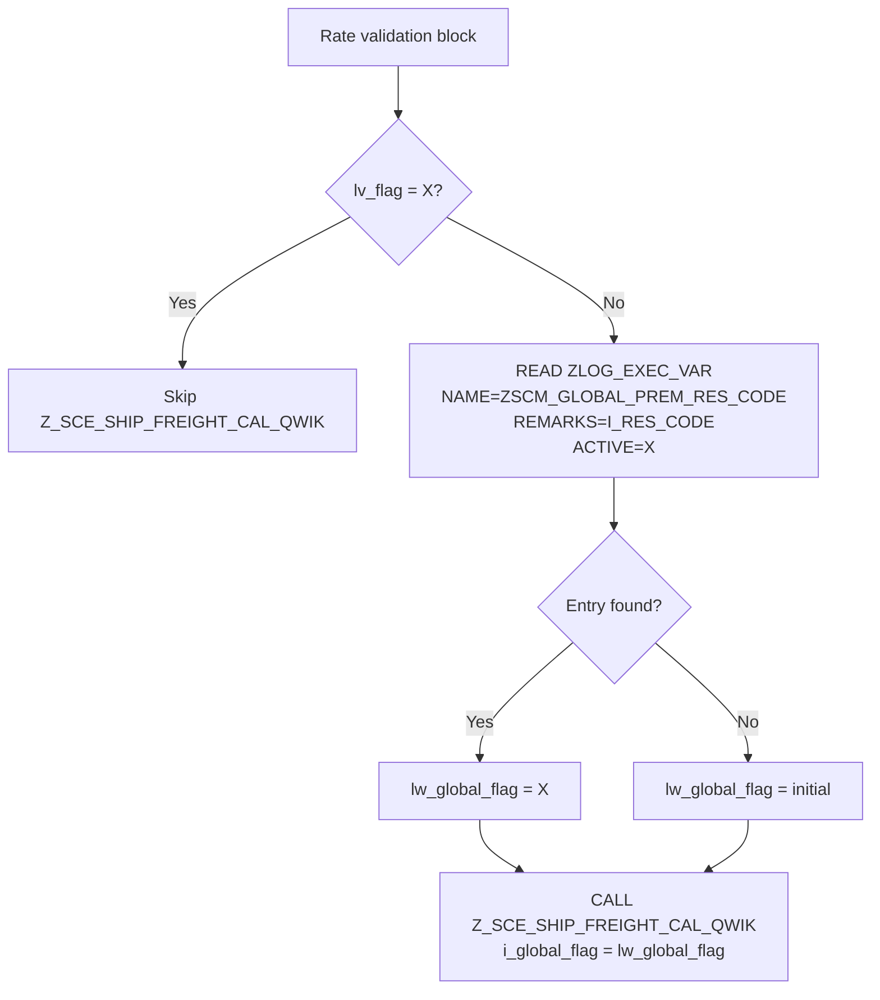

# Global Premium Reason Code — Z_SCM_VENDOR_SAVE_REASSIGN

**Function Module:** `Z_SCM_VENDOR_SAVE_REASSIGN`  
**Function Group:** `ZSCM_TRUCK_VENDOR_REASSIGN`  
**System:** RD2 (source verified via SAP MCP)  
**Config Table:** `ZLOG_EXEC_VAR`

## Summary

Before calling `Z_SCE_SHIP_FREIGHT_CAL_QWIK`, read `ZLOG_EXEC_VAR` to determine whether the input reason code qualifies for global/premium rate calculation, and set `lw_global_flag` accordingly.

| Req | Description |
|-----|-------------|
| 1 | Read `ZLOG_EXEC_VAR` where `NAME = ZSCM_GLOBAL_PREM_RES_CODE`, `REMARKS = I_RES_CODE`, `ACTIVE = X` |
| 2 | If entry exists, set `lw_global_flag = 'X'` before `CALL FUNCTION 'Z_SCE_SHIP_FREIGHT_CAL_QWIK'` |

## Current State (RD2)

| Item | Status |
|------|--------|
| `lw_global_flag` | Declared but **never set** — always initial when passed to `Z_SCE_SHIP_FREIGHT_CAL_QWIK` |
| `ZLOG_EXEC_VAR` bulk SELECT | Already exists with `AND active = abap_true` |
| Spot vendor pattern | Already uses `READ TABLE lt_zlog_exec_var` with `REMARKS = i_res_code` |
| `ZSCM_GLOBAL_PREM_RES_CODE` | **Not yet configured** in RD2 (config to be created) |

**Parameter mapping:** The FM importing parameter is `I_RES_CODE` (requirement refers to this as `I_REASON_CODE`). Use `i_res_code` in code.

## Prerequisite — Configuration (Basis / SM30)

Create and maintain entries in `ZLOG_EXEC_VAR` for parameter `ZSCM_GLOBAL_PREM_RES_CODE` (not yet present in RD2 at time of analysis).

| NAME | NUMB | REMARKS | ACTIVE |
|------|------|---------|--------|
| `ZSCM_GLOBAL_PREM_RES_CODE` | 0001 | `R15` | X |
| `ZSCM_GLOBAL_PREM_RES_CODE` | 0002 | `R18` | X |

- **REMARKS** — reason code passed as `I_RES_CODE` (e.g. `R15`, `R18`)
- **ACTIVE** — `X`

This replaces the hardcoded `R15`/`R18` logic used in `ZLOG_CHNGE_TRUCK_VEND_CLS` → `handle_same_rate_logic`.

## Objects to Change

| ID | Location | Change |
|----|----------|--------|
| CH-GP01 | CONSTANTS section | Add `lc_global_prem_res_code` |
| CH-GP02 | SELECT from `ZLOG_EXEC_VAR` | Add `lc_global_prem_res_code` to `WHERE name IN (...)` |
| CH-GP03 | Before `Z_SCE_SHIP_FREIGHT_CAL_QWIK` | READ config; set `lw_global_flag = 'X'` if entry exists |

---

## Change 1 — Add Constant

In the **CONSTANTS** section (after `lc_spot_vend_list`):

```abap
lc_global_prem_res_code TYPE rvari_vnam VALUE 'ZSCM_GLOBAL_PREM_RES_CODE'.
```

---

## Change 2 — Include Config Key in Bulk SELECT

Add `lc_global_prem_res_code` to the existing `WHERE name IN (...)` clause:

```abap
SELECT  name
        shtyp
        shtype
        mfrgr
        active
        remarks
        transplpt
        spart
        rfcdest
        ewb_uom_d
        zzpmatkl1
        lifnr
        errormsg
  FROM zlog_exec_var
  INTO TABLE lt_zlog_exec_var
 WHERE name IN ( gc_business,
                 gc_product_cat,
                 gc_subform_id,
                 gc_servcat,
                 gc_business_id,
                 gc_rate_validate,
                 gc_mail_id,
                 gc_validate_shtyp,
                 gc_pol_subform_id,
                 gc_vendor_change,
                 gc_subformatid,
                 gc_zscm_intchng_ord,
                 lc_zscm_efr_check_reassign,
                 lc_z_scm_get_business,
                 lc_business,
                 lc_subbusiness,
                 lc_scm_get_sub_prod_id,
                 lc_zscm_get_rpl_sub,
                 lc_subformat,
                 lc_spot_vend_list,
                 'ZSCM_SPOT_VEND_REASSIGN',
                 lc_global_prem_res_code )    " << ADD THIS
   AND active = abap_true.
```

The global `active = abap_true` filter already satisfies **ACTIVE = X**.

---

## Change 3 — Set `lw_global_flag` Before `Z_SCE_SHIP_FREIGHT_CAL_QWIK` (Req 1 & 2)

Insert **inside** the existing `IF lv_flag NE 'X'.` guard, **immediately before** `CALL FUNCTION 'Z_SCE_SHIP_FREIGHT_CAL_QWIK'`:

```abap
"--- Req 1 & 2: Set global/premium rate flag from ZLOG_EXEC_VAR
CLEAR lw_global_flag.
READ TABLE lt_zlog_exec_var TRANSPORTING NO FIELDS
  WITH KEY name    = lc_global_prem_res_code
           remarks = i_res_code
           active  = abap_true.
IF sy-subrc = 0.
  lw_global_flag = abap_true.    " = 'X'
ENDIF.

" FM to check shipment rate for the new vendor
lv_truckno = lw_vttk-signi+0(15).
CALL FUNCTION 'Z_SCE_SHIP_FREIGHT_CAL_QWIK'
  EXPORTING
    i_tknum         = i_shipno
    i_contract_type = lw_contract_type
    i_tdlnr         = i_lifnr
    i_truck_no      = lv_truckno
    i_quan          = lw_lfimg
    i_confirm       = abap_true
    i_global_flag   = lw_global_flag
    i_sub_format    = lw_sub_format1
    i_old_tdlnr     = lw_gbl_old_tdlnr
  IMPORTING
    e_freight_amt   = lw_freight_amt
    et_return       = lt_ret
    e_catype        = lw_catype
    e_add03         = lw_add03
    e_knumh         = lw_knumh.
```

---

## Filter Mapping (Req 1)

| Filter | Value |
|--------|-------|
| `NAME` | `ZSCM_GLOBAL_PREM_RES_CODE` |
| `REMARKS` | `I_RES_CODE` (requirement: `I_REASON_CODE`) |
| `ACTIVE` | `X` (via bulk SELECT) |
| Action if found | `lw_global_flag = 'X'` |

---

## Logic Flow



---

## Reference Pattern

Mirrors the existing spot vendor check in the same FM:

```abap
READ TABLE lt_zlog_exec_var TRANSPORTING NO FIELDS
  WITH KEY name    = lc_spot_vend_list
           remarks = i_res_code
           active  = abap_true.
```

And aligns with `handle_same_rate_logic` in `ZLOG_CHNGE_TRUCK_VEND_CLS`, which hardcodes `R15`/`R18` for `gw_global_flag`.

---

## Important Notes

1. **No FM interface change** — `I_RES_CODE` is already an importing parameter.
2. **`lw_gbl_old_tdlnr`** is already set earlier (`lw_gbl_old_tdlnr = lw_vttk-tdlnr`) — no additional change needed.
3. **When config is missing** — `lw_global_flag` stays initial; freight FM runs in non-global mode (same as current behaviour).
4. **Config must exist before UAT** — without `ZSCM_GLOBAL_PREM_RES_CODE` entries, `i_global_flag` will never be `'X'` for R15/R18.
5. **Downstream impact** — `Z_SCE_SHIP_FREIGHT_CAL_QWIK` uses `i_global_flag = abap_true` for global/premium rate logic; ensure related charge-code config (`ZSCM_REASSIGN_CHRGE_CODE`) is in place if that change is also planned.
